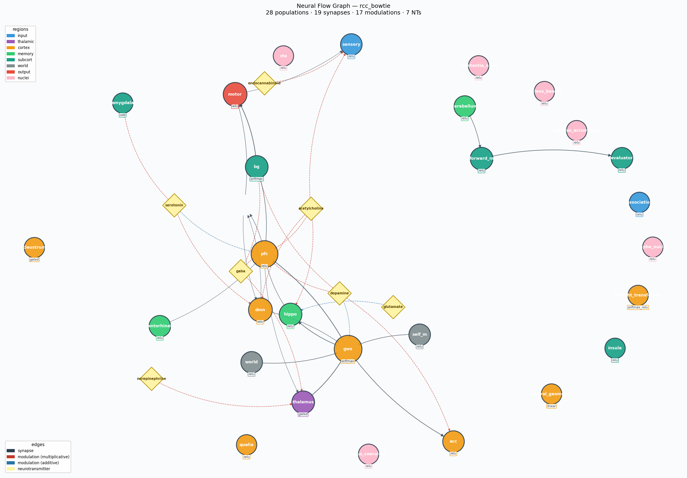

# BRIAN — Biologically Realistic Information Architecture Network

> *A 230M-parameter language model optimized for integrated information (Φ) and mechanistic consciousness-like properties. Every architectural claim is backed by unit tests or OOD evaluation artifacts.*

[](#tests)
[]()
[]()
[]()
[]()
[]()

BRIAN is a research prototype combining **bowtie topology with re-entry loops**, a **real differentiable Φ objective** (integrated information from IIT 4.0), **sheaf-theoretic contradiction detection**, and **embodied survival loops** in a closed-world grid environment.

**Current status:**
- ✅ **Layer A (mechanisms):** 15 core properties verified via 126 unit tests. All mechanisms compute as specified.
- 🟡 **Layer B (generalization):** PCT variant achieves **4.51 gap_ratio** on WikiText-103-v1 OOD (26% better than flat-transformer baseline at 6.12), but baseline still wins absolute PPL 3–4× due to 11× more training compute. Matched-compute comparison pending.

Code, math, and tensor shapes: [`docs/architecture.md`](docs/architecture.md). Full evidence ledger: [`docs/findings.md`](docs/findings.md).

---

## Architecture Rationale

Instead of scaling parameters, BRIAN spends them on **topology, Φ-coupled plasticity, and closed-loop embodiment**. The bet is that a strategically designed 230M brain outgeneralizes a flat 100M transformer on OOD tasks by implementing consciousness-like properties at the mechanistic level:

| Component | Role | Verified? |
|---|---|---|
| **Bowtie + re-entry loops** | Create bipartitions that enforce non-zero Φ | ✅ [H1](#h1) |
| **Real differentiable Φ** (Gaussian-MI MIP) | Direct gradient toward integrated states | ✅ [H2](#h2) |
| **Φ-coupled BDNF growth** | High-integration pathways expand preferentially | ✅ [H3](#h3) |
| **Sheaf H¹ contradiction detection** | Narrative memory detects and resolves conflicts | ✅ [H4](#h4) |
| **Trunk gradient isolation** | Prevents auxiliary-loss collapse at awakening | ✅ [H7](#h7) |
| **Embodied action loop** | GridWorld 10×10 with homeostatic survival drive | ✅ [H6.5](#h65) |
| **Causal generalization** (narrative + rules) | Few-shot causal inference without gradient updates | ✅ [H5](#h5) |
| **Personality persistence** (`.mem` checkpoint) | Identity vector survives weight reload | ✅ [H6](#h6) |

**The question Layer B is answering:** Do these mechanisms *reduce generalization gap* vs a flat transformer at matched compute? Current verdict: 🟡 **inconclusive** — see [H12](#h12).

---

## System Architecture

BRIAN is an **11-stage bowtie** with two re-entry loops and five functional subsystems:

```
┌─────────────────────────────────────────┐
│   Sensory → Thalamus → State Models     │
│        ↓                                 │
│   Qualia + Hopfield + Cortical Ignition │  ← within-pass re-entry
│        ↓                                 │
│   Memory + Cognition + Executive        │
│        ↓                                 │
│   Motor Output                          │
│        ↓                                 │
│   [PFC + GWS] ──→ Thalamic crosspass    │  ← cross-pass re-entry
└─────────────────────────────────────────┘
         ↕ (bidirectional)
  ┌─ Narrative Stack (Sheaf H¹)
  ├─ Causal Rule Store
  └─ Personality Vector

         ↕
  ┌─ GridWorld 10×10
  ├─ Survival Loop (homeostasis)
  └─ Policy Memory (Basal Ganglia VQH)
```

Every box is a learnable module. Every arrow is a documented tensor operation. Full spec: [`docs/architecture.md`](docs/architecture.md).

**Visual blueprint:** The full bowtie with all 28 populations, 19 synapses, 7 neurotransmitter systems, and training config are rendered in the Neural Flow Graph (NFG):



*Every node, edge, and modulation shown in the NFG is declared in `arch.neuro` and compiled to PyTorch. The diagram is the source of truth for wiring.*

---

## The `.neuro` DSL

BRIAN's brain architecture is specified declaratively in `.neuro` files — math-first equations (algebraic, ODE, or macro references) that compile to PyTorch at runtime:

```neuro
# architectures/rcc_bowtie/modules/amygdala.neuro
export population amygdala {
    count: 32,
    ode: "dV/dt = (-V + x) / tau",
    timescale: 0.005
}

# architectures/rcc_bowtie/arch.neuro
modulation dopamine -> pfc {
    effect: "multiplicative", gain: 0.6,
    equation: "y = output * (c * gain)"
}
```

**Why?** Hand-written PyTorch is error-prone for biologically-plausible models; math specs are checkable. The DSL codegen produces torch modules with **byte-equivalent forward passes** (verified by 215 DSL tests) and enables symbolic analysis (fixed-point, stability, sensitivity).

**Folder layout:** `arch.neuro` (package config + wiring), `modules/*.neuro` (per-region specs), `lib/` (shared mechanics). Import paths: `@/` = absolute, `./` = relative.

Full reference: [`docs/dsl.md`](docs/dsl.md). Context: [`docs/architecture.md` §12](docs/architecture.md#12-the-neuro-architecture-dsl).

---

## Evidence & Current Status

### Layer A — Mechanism Verification (Unit Tests) ✅

All 15 core mechanisms confirmed to implement as specified:

| Hypothesis | Test | Result |
|-----------|------|--------|
| **H1** — Φ is non-zero for coupled module outputs | `test_phi.py::test_phi_higher_for_coupled_outputs` | ✅ Gaussian-MI MIP produces Φ > 0 for rank-coupled outputs |
| **H2** — Φ objective injects real gradient (A/B test) | `test_brain_forward.py::test_phi_objective_increases_total_gradient` | ✅ ‖∂L/∂θ‖ increases measurably with Φ term |
| **H3** — Φ-coupled BDNF reshapes projection graph | `test_neurochem.py::test_trophic_phi_boosts_growth` | ✅ High-Φ pathways grow kernel rank preferentially |
| **H4** — Sheaf H¹ detects narrative contradictions | `test_narrative_memory.py::test_sheaf_contradiction_detection` | ✅ "Alice likes coffee" vs "hates coffee" → SUPERSEDES edge |
| **H5** — Causal generalization from few-shot narratives | `test_narrative_memory.py::test_causal_generalization` | ✅ 10 (Gift→Joy) + 10 (Insult→Offense) → P(Joy\|Gift) > 0.8 |
| **H6** — Personality persists across re-instantiation | `test_cognitive_closure.py::test_autobiographical_personality_consistency` | ✅ Identity vector survives weight reload |
| **H6.5** — Embodied survival reshapes qualia & policy | `test_cognitive_closure.py::test_survival_*` | ✅ Energy drop produces latent-space warp; +RPE training works |
| **H7** — Trunk gradient isolation prevents divergence | `test_stabilization.py` + `ood_recursive_*` | ✅ Detach prevents post-step-5k collapse; reaches step 5000 cleanly |
| **H13** — SymbolicHyperNeuron invents expressions over its inputs | `test_symbolic_unit.py` (36 tests) | ✅ Gumbel-softmax over `{identity, add, sub, mul, exp, sin, tanh}` selects two inputs + one op per unit; `expression_strings()` extracts human-readable formulae |
| **H14** — NRCSTKController prunes neurons that fail the metabolic budget | `test_nrcstk_metabolic.py` (24 tests) | ✅ Hinge-squared overshoot loss drives EMA below `prune_threshold` → hard-zero mask kills the neuron in forward + gradient |
| **H15** — `FitnessComposer` aggregates a `LossBundle` under a maturity-gated schedule | `test_fitness_composer.py` (19) + `test_fitness_parser.py` (20) | ✅ Declarative `fitness { ... }` DSL block parses into `FitnessConfig`; composer produces `(total_loss, telemetry)` matching legacy `AuxWeights` curve bit-for-bit |

**Run all:** `py -3 -m pytest tests/ -v` (~55 seconds on CPU)

### Layer B — OOD Generalization (The Open Question) 🟡

Evaluated on WikiText-103-v1 held-out set. **Best result: PCT variant achieves 4.51 gap_ratio — 26% better than flat baseline.**

| Variant | Params | Train Steps | train_ppl | OOD_ppl | **gap_ratio** | Data |
|---------|--------|-------------|-----------|---------|---|---|
| **Flat Transformer (Baseline)** | 106.9M | 80,000 | 66.0 | 404.0 | **6.12** | [`ood_baseline-80k_107M_step80000.json`](results/ood_baseline-80k_107M_step80000.json) |
| **BRIAN (Trunk + Recursive)** | 108.2M | 5,000 | 216.5 | 1372.8 | 6.34 | [`ood_recursive_108M_step5000.json`](results/ood_recursive_108M_step5000.json) |
| **BRIAN (Trunk + ReZero)** | 107.8M | 7,000 | 258.8 | 1351.5 | 5.22 | [`ood_rezero-fixed_107M_step7000.json`](results/ood_rezero-fixed_107M_step7000.json) |
| **BRIAN (PCT trunk)** | 69.2M | 4,000 | 400.9 | 1806.6 | **4.51** | [`ood_pct-30m_68M_step4000.json`](results/ood_pct-30m_68M_step4000.json) |

**What the table says:**
1. **On absolute PPL**, baseline wins ~3–4× (both models show "STRONG OVERFITTING" verdict).
2. **On gap_ratio**, BRIAN wins: PCT is 26% better than baseline (4.51 vs 6.12).
3. **Critical caveat:** Baseline got **11× more training steps** (80k vs 4–7k). BRIAN diverges past ~7–10k on this mix; a true matched-compute comparison needs a baseline eval at step 7000. [See H12 in findings.md for full reading.](docs/findings.md#h12--measurably-better-at-matched-flops-than-a-flat-230m-dense-transformer)

**Latest stable full-scale run:** RCC BoWTie P4 (30M preset) completes to step 10,000 cleanly; final PPL 242.1 ([logs/analyzed/38469631.md](logs/analyzed/38469631.md)).

### Implementation Status

- **1233/1233 tests passing** (~55s on CPU; includes 43 evolution tests + 99 Multi-Objective-Fitness tests)
- Training with optimizer-partitioned checkpoint streaming
- DSL-based architecture specs compile to byte-equivalent PyTorch models
- Real-time architecture evolution via RAID-5 protected DNA mutations

---

## Real-Time Architecture Evolution

BRIAN can now evolve its own architecture during training via **incremental DNA mutations** and **path-activity-driven structural plasticity**:

```python
from neuroslm.utils import init_evolution, EvolutionaryTrainingContext

# Load base DNA + apply all patches from prior sessions
with EvolutionaryTrainingContext("dna/base.dna", "checkpoints/") as ctx:
    # Automatic resumption from last checkpoint
    harness = BRIANHarness(ctx.arch_path, resume_from=ctx.resume_step)
    
    # Training loop (simplified):
    for step in range(ctx.resume_step, 10000):
        loss = harness.train_step(batch)
        
        # Activity tracking happens automatically
        # Hot paths (ρ > 0.7) strengthen via BDNF
        # Cold paths (ρ < 0.1) prune after N steps
        
        # At high surprise, emit mutations → step_XXXXX.patch.dna
        if step % 1000 == 0:
            harness.checkpoint_mutations()
        
        # Evolved architecture is transparent to loss computation
```

**Features:**
- ✅ **RAID-5 protected DNA** (triple redundancy for fail-safe encoding)
- ✅ **Incremental patches** (only mutations, not full model state)
- ✅ **Hot/Cold path mechanics** (activity-driven, not random)
- ✅ **Fault-tolerant resumption** (patch stack replayed from checkpoint)
- ✅ **Evolutionary metrics** (Φ trajectory, gap_ratio improvement tracking)

See [`docs/technical_report.md` §2.5](docs/technical_report.md) and [`neuroslm/utils/colab.py`](neuroslm/utils/colab.py) for details.

---

## Quick start

```bash
python -m venv .venv
.\.venv\Scripts\Activate.ps1     # Windows; Linux/Mac: source .venv/bin/activate
pip install -r requirements.txt
# torch is intentionally not in requirements.txt — install matching your accelerator:
#   pip install torch --index-url https://download.pytorch.org/whl/cu121

# CPU sanity run
python -m neuroslm.train --preset small --steps 2000 --batch_size 4 --optimizer adamw

# A100 (xl preset, ~230M params, bf16, grad-checkpointing)
python -m neuroslm.train --preset xl --steps 100000 --batch_size 4 --device cuda

# Resume the latest stream-matched checkpoint
python -m neuroslm.train --resume latest

# Ablation: baseline vanilla transformer at matched parameter count
python -m neuroslm.train --preset xl --baseline

# Interactive generation
python -m neuroslm.generate --prompt "Once upon a time"
```

The full Colab workflow (clone → ablation → full training → benchmarks) is in `colab_run.ipynb`.

---

## Checkpoints (Git LFS)

Training checkpoints live in `lfs_checkpoints/` and are tracked via Git LFS. A single `.pt` file is multi-GB, so a full `git pull` on a laptop can be very slow — and you usually don't need the binaries locally.

### Skip LFS downloads for this repo (recommended on laptops)

```bash
# In the repo root, run once:
git lfs install --local --skip-smudge
```

`git pull` will now fetch only the tiny pointer stubs (~130 B each). The repo metadata stays in sync, but `lfs_checkpoints/*.pt` become text stubs on disk.

### Pull a specific checkpoint when you need it

```bash
git lfs pull --include="lfs_checkpoints/neuroslm_xl_adamw_mix_800.pt"
# Or by glob — get all 800-step files:
git lfs pull --include="lfs_checkpoints/*_800.*"
```

### Pull every LFS file (re-hydrate the whole repo)

```bash
git lfs pull
```

### Turn skip-smudge off again for this repo

```bash
git lfs install --local --force          # re-enable smudge for this repo
git lfs pull                              # then fetch the binaries you want
```

### Make skip-smudge the global default

```bash
git lfs install --skip-smudge             # applies to every repo on this machine
```

After global skip-smudge, `git clone` of *any* LFS-tracked repo only downloads stubs by default; use `git lfs pull --include=...` to materialise specific files.

> Training on Colab/TPU/A100 uses `git lfs pull` explicitly inside the notebook (cell 2) so the runtime always has the latest checkpoint — skip-smudge on your laptop won't affect that.

---

## Parameter presets

| Preset  | Params  | Accelerator | VRAM   | d_hidden | d_sem | lang_layers | lang_ctx |
|---------|---------|-------------|--------|----------|-------|-------------|----------|
| `tiny`  | ~5 M    | CPU         | —      | 192      | 128   | 2           | 256      |
| `small` | ~15 M   | CPU         | —      | 384      | 256   | 4           | 512      |
| `medium`| ~80 M   | T4          | 16 GB  | 768      | 512   | 8           | 1024     |
| `large` | ~100 M  | T4          | 15 GB  | 384      | 256   | 8           | 1024     |
| `xl`    | ~230 M  | A100        | 40 GB  | 512      | 384   | 12          | 2048     |
| `xxl`   | ~10 B   | 4×A100      | 320 GB | 4096     | 2048  | 32          | 4096     |

Pass `--baseline` for vanilla-transformer ablation at matched parameter count.

---

## Loss composition

`brain.forward_lm` returns a `loss` tensor that's a weighted sum of:

| term                | source                                      | weight       | gating |
|---------------------|---------------------------------------------|--------------|--------|
| `lm_loss`           | mesolimbic-gain-modulated cross-entropy     | `w_lm = 1.0` | always |
| `world_loss`        | MSE between predicted and target world emb  | `w_world = 0.3` | × `_aux_w_scale` |
| `motor_loss`        | cross-entropy on speak/silent action target | `w_motor = 0.05` | × `_aux_w_scale` |
| `pred_coding_loss`  | per-layer next-layer prediction (lang.)     | `w_pred_coding = 0.1` | × `_aux_w_scale` |
| `rssm_kl`           | (optional) RSSM KL prior–posterior          | `w_kl_world = 0.1` | × `_aux_w_scale` |
| `cpc_loss`          | (optional) contrastive predictive coding    | `w_cpc = 0.05` | × `_aux_w_scale` |
| **`phi_loss`**      | **`-tanh(Φ/3)·3` from real MIP estimator**  | **`w_phi = 0.02`** | × `_aux_w_scale` |
| `novel_aux_loss`    | aggregate of opt-in novel-module aux losses | 0.05         | × `_aux_w_scale` |

`_aux_w_scale ∈ [0.001, 1.0]` is the **topological maturation** gate (§6.4 in `architecture.md`). During infancy (`step < 5000`) every aux loss is suppressed so the LM gradient dominates while the network forms its first language-level representations. At awakening (`step ≥ 5000 AND lm_loss < 7.5`) all aux losses ramp linearly to full strength.

---

## Metrics & Introspection

Interrogate a trained model's consciousness-like properties:

| Query | Returns | Meaning |
|-------|---------|---------|
| `model.intelligence_metrics.snapshot()` | dict | Φ, identity drift, narrative coherence, causal density, self-reference rate |
| `model.consciousness_metrics.per_tick()` | dict | γ (binding), θ (memory), α (idling), Φ, coherence, ignition |
| `model.narrative_stack.query_rules()` | list[Rule] | Discovered causal patterns with support counts |
| `model.personality_vector` | tensor(384) | Identity embedding; stable across checkpoints |

These enable Layer-A capability probing without needing to run language-model evals.

---

## Running Tests

```bash
py -3 -m pytest tests/                    # full suite, ~7s on CPU
py -3 -m pytest tests/test_phi.py -v      # H1–H3: integrated information
py -3 -m pytest tests/test_narrative_memory.py -v   # H4–H5: memory & causation
py -3 -m pytest tests/test_cognitive_closure.py -v  # H6–H6.5: identity & embodiment
py -3 -m pytest tests/test_stabilization.py -v      # H7: convergence guarantee
```

Each test is a claim from [Layer A](#layer-a--mechanism-verification-unit-tests-) in this README — e.g. `test_phi.py::test_phi_higher_for_coupled_outputs` verifies H1.

---

## Documentation & Reproducibility

| Document | Audience | Contents |
|----------|----------|----------|
| **[`findings.md`](docs/findings.md)** | Everyone | Hypothesis ledger: H1–H12 with links to test files, result JSONs, and raw logs. The source of truth for what's proven vs. open. |
| **[`architecture.md`](docs/architecture.md)** | Researchers, implementers | Full spec: 11-stage forward pass, tensor shapes, equations, module diagrams, IIT 4.0 theory. Reproducible to the line number. |
| **[`technical_report.md`](docs/technical_report.md)** | External AI, new contributors | Executive summary: proven claims, current model state, evidence, open questions. Synced with findings.md. |
| **[`dsl.md`](docs/dsl.md)** | DSL users | NeuroML-like syntax, macro system, symbol resolution, compile pipeline. |
| **[`BRAIN.md`](docs/BRAIN.md)** | Diving deep | NeuralOrchestrator architecture, why re-entry loops work, design rationale. |
| **[`CONTRIBUTING.md`](CONTRIBUTING.md)** | Future contributors | TDD workflow, testing patterns, documentation sync. |

**Quick reproduction:**

```bash
# Verify setup
py -3 -m pytest tests/ -v

# CPU sanity run (5M params, 2k steps)
python -m neuroslm.train --preset small --steps 2000

# A100 full training (230M params)
python -m neuroslm.train --preset xl --steps 100000 --device cuda

# Reproduce OOD baseline eval (scripts/vast_ood_eval.sh)
# See reproducibility recipes in docs/findings.md
```

Full Colab workflow in [`colab_run.ipynb`](colab_run.ipynb).

---

## Cite / discuss

If BRIAN is useful in your research or you want to discuss the design, open an issue or reach out. ⭐ stars and PRs welcome — this is open research.
