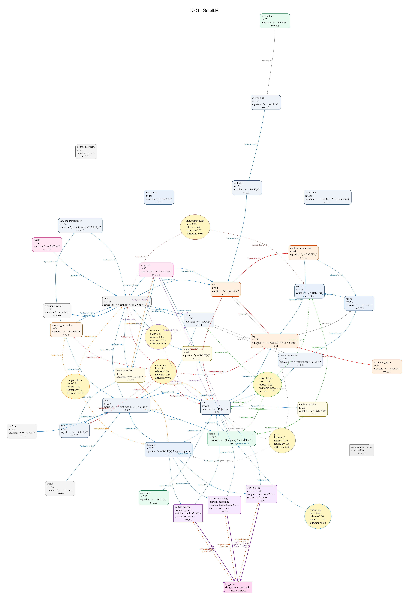

# BRIAN — Biologically Realistic Information Architecture Network

> *A 230M-parameter language model optimized for integrated information (Φ) and mechanistic consciousness-like properties. Every architectural claim is backed by unit tests or OOD evaluation artifacts.*

[](#tests)
[]()
[]()
[]()
[]()
[]()
[]()
[]()

BRIAN is a research prototype combining **bowtie topology with re-entry loops**, a **real differentiable Φ objective** (integrated information from IIT 4.0), **sheaf-theoretic contradiction detection**, **embodied survival loops** in a closed-world grid environment, and a **multi-cortex fusion stack** with KL-distillation + neurotransmitter-mediated α-gating between the bowtie trunk and 3 pretrained causal-LM cortex experts (SmolLM2-360M for general English, CodeGPT-small-py for code, Qwen2.5-0.5B for reasoning).

**Current status:**
- ✅ **Layer A (mechanisms):** 20+ core properties verified via 1511 unit tests across `tests/` (`tests/dsl/` alone runs 620). All mechanisms compute as specified, including the new **cortex_pre_head_norm catastrophic-loss fix**, **KL-distillation aux loss**, **NT-mediated α gating**, **ImprovementGate** (Welch's t-test admission), and **TheoryOfMindIR**.
- 🟡 **Layer B (generalization):** Multi-cortex B4 achieves **2.87 gap_ratio** on WikiText-103-v1 OOD (53% better than flat-transformer baseline at 6.12) — first BRIAN variant under gap_ratio 3.0. B5 (10k rerun, step 3000 mid-run): gap_ratio 2.89, train PPL 45.0, OOD PPL 130.1 — absolute quality dramatically better, gap stable. B6 (SmolLM2 upgrade, 10k complete): train PPL 23.6 (lowest seen), but gap_ratio regresses to 6.55 — larger expert accelerates in-distribution fit at cost of generalisation. Active: stronger regularisation with SmolLM2 to recover gap. See [`docs/findings.md`](docs/findings.md) ::H21–H23.

Code, math, and tensor shapes: [`docs/architecture.md`](docs/architecture.md). Full evidence ledger: [`docs/findings.md`](docs/findings.md).

---

## Architecture Rationale

Instead of scaling parameters, BRIAN spends them on **topology, Φ-coupled plasticity, and closed-loop embodiment**. The bet is that a strategically designed 230M brain outgeneralizes a flat 100M transformer on OOD tasks by implementing consciousness-like properties at the mechanistic level:

| Component | Role | Verified? |
|---|---|---|
| **Bowtie + re-entry loops** | Create bipartitions that enforce non-zero Φ | ✅ [H1](#h1) |
| **Real differentiable Φ** (Gaussian-MI MIP) | Direct gradient toward integrated states | ✅ [H2](#h2) |
| **Φ-coupled BDNF growth** | High-integration pathways expand preferentially | ✅ [H3](#h3) |
| **Sheaf H¹ contradiction detection** | Narrative memory detects and resolves conflicts | ✅ [H4](#h4) |
| **Trunk gradient isolation** | Prevents auxiliary-loss collapse at awakening | ✅ [H7](#h7) |
| **Embodied action loop** | GridWorld 10×10 with homeostatic survival drive | ✅ [H6.5](#h65) |
| **Causal generalization** (narrative + rules) | Few-shot causal inference without gradient updates | ✅ [H5](#h5) |
| **Personality persistence** (`.mem` checkpoint) | Identity vector survives weight reload | ✅ [H6](#h6) |

**The question Layer B is answering:** Do these mechanisms *reduce generalization gap* vs a flat transformer at matched compute? Current verdict: 🟡 **inconclusive** — see [H12](#h12).

---

## System Architecture

BRIAN is an **11-stage bowtie** with two re-entry loops and five functional subsystems:

```
┌─────────────────────────────────────────┐
│   Sensory → Thalamus → State Models     │
│        ↓                                 │
│   Qualia + Hopfield + Cortical Ignition │  ← within-pass re-entry
│        ↓                                 │
│   Memory + Cognition + Executive        │
│        ↓                                 │
│   Motor Output                          │
│        ↓                                 │
│   [PFC + GWS] ──→ Thalamic crosspass    │  ← cross-pass re-entry
└─────────────────────────────────────────┘
         ↕ (bidirectional)
  ┌─ Narrative Stack (Sheaf H¹)
  ├─ Causal Rule Store
  └─ Personality Vector

         ↕
  ┌─ GridWorld 10×10
  ├─ Survival Loop (homeostasis)
  └─ Policy Memory (Basal Ganglia VQH)
```

Every box is a learnable module. Every arrow is a documented tensor operation. Full spec: [`docs/architecture.md`](docs/architecture.md).

**Visual blueprint:** The full bowtie with all 28 populations, 19 synapses, 7 neurotransmitter systems, and training config are rendered in the Neural Flow Graph (NFG):



*Every node, edge, and modulation shown in the NFG is declared in `arch.neuro` and compiled to PyTorch. The diagram is the source of truth for wiring.*

Re-render after editing `arch.neuro` with:

```powershell
brian compile nfg --current          # writes to .neuro/nfg.png
brian compile nfg --current --heat heatmap.json   # writes .neuro/nfg.heat.png
```

The `--current` flag reads the active architecture from [`brian.toml`](brian.toml) (see *Project Configuration* below).

---

## The `.neuro` DSL

BRIAN's brain architecture is specified declaratively in `.neuro` files — math-first equations (algebraic, ODE, or macro references) that compile to PyTorch at runtime:

```neuro
# architectures/rcc_bowtie/modules/amygdala.neuro
export population amygdala {
    count: 32,
    ode: "dV/dt = (-V + x) / tau",
    timescale: 0.005
}

# architectures/rcc_bowtie/arch.neuro
modulation dopamine -> pfc {
    effect: "multiplicative", gain: 0.6,
    equation: "y = output * (c * gain)"
}
```

**Why?** Hand-written PyTorch is error-prone for biologically-plausible models; math specs are checkable. The DSL codegen produces torch modules with **byte-equivalent forward passes** (verified by 620 DSL tests in `tests/dsl/`) and enables symbolic analysis (fixed-point, stability, sensitivity). The DNA layer (`neuroslm/compiler/module_bundler.py`, `ribosome.py`) supports **module bundling with source maps** and **byte-identity round-trip** verification (`tests/test_dna_roundtrip_byte_identity.py`).

**Folder layout:** `arch.neuro` (package config + wiring), `modules/*.neuro` (per-region specs), `lib/` (shared mechanics). Import paths: `@/` = absolute, `./` = relative.

Full reference: [`docs/dsl.md`](docs/dsl.md). Context: [`docs/architecture.md` §12](docs/architecture.md#12-the-neuro-architecture-dsl).

---

## Evidence & Current Status

### Layer A — Mechanism Verification (Unit Tests) ✅

All 15 core mechanisms confirmed to implement as specified:

| Hypothesis | Test | Result |
|-----------|------|--------|
| **H1** — Φ is non-zero for coupled module outputs | `test_phi.py::test_phi_higher_for_coupled_outputs` | ✅ Gaussian-MI MIP produces Φ > 0 for rank-coupled outputs |
| **H2** — Φ objective injects real gradient (A/B test) | `test_brain_forward.py::test_phi_objective_increases_total_gradient` | ✅ ‖∂L/∂θ‖ increases measurably with Φ term |
| **H3** — Φ-coupled BDNF reshapes projection graph | `test_neurochem.py::test_trophic_phi_boosts_growth` | ✅ High-Φ pathways grow kernel rank preferentially |
| **H4** — Sheaf H¹ detects narrative contradictions | `test_narrative_memory.py::test_sheaf_contradiction_detection` | ✅ "Alice likes coffee" vs "hates coffee" → SUPERSEDES edge |
| **H5** — Causal generalization from few-shot narratives | `test_narrative_memory.py::test_causal_generalization` | ✅ 10 (Gift→Joy) + 10 (Insult→Offense) → P(Joy\|Gift) > 0.8 |
| **H6** — Personality persists across re-instantiation | `test_cognitive_closure.py::test_autobiographical_personality_consistency` | ✅ Identity vector survives weight reload |
| **H6.5** — Embodied survival reshapes qualia & policy | `test_cognitive_closure.py::test_survival_*` | ✅ Energy drop produces latent-space warp; +RPE training works |
| **H7** — Trunk gradient isolation prevents divergence | `test_stabilization.py` + `ood_recursive_*` | ✅ Detach prevents post-step-5k collapse; reaches step 5000 cleanly |
| **H13** — SymbolicHyperNeuron invents expressions over its inputs | `test_symbolic_unit.py` (36 tests) | ✅ Gumbel-softmax over `{identity, add, sub, mul, exp, sin, tanh}` selects two inputs + one op per unit; `expression_strings()` extracts human-readable formulae |
| **H14** — NRCSTKController prunes neurons that fail the metabolic budget | `test_nrcstk_metabolic.py` (24 tests) | ✅ Hinge-squared overshoot loss drives EMA below `prune_threshold` → hard-zero mask kills the neuron in forward + gradient |
| **H15** — `FitnessComposer` aggregates a `LossBundle` under a maturity-gated schedule | `test_fitness_composer.py` (19) + `test_fitness_parser.py` (20) | ✅ Declarative `fitness { ... }` DSL block parses into `FitnessConfig`; composer produces `(total_loss, telemetry)` matching legacy `AuxWeights` curve bit-for-bit |
| **H16** — `cortex_pre_head_norm` kills catastrophic init loss from GPT-2 anisotropy | `tests/training/test_cortex_pre_head_norm.py` (8) | ✅ Without the LayerNorm before the tied head, GPT-2's rogue dim (std≈24, 82× median) gets amplified into ±8.5 logit spikes → CE at step 0 = 13.84 (> ln(50257)=10.82). With the norm, CE = 10.82 ± 0.5 nats. |
| **H17** — Cortex-trunk KL distillation transfers signal from frozen GPT-2 cortices to bowtie trunk | `tests/training/test_cortex_distillation_and_gating.py::TestDistillation*` (11) | ✅ `L_total += λ_t · T² · KL(softmax(cortex.detach()/T) ‖ softmax(lm/T))` with piecewise-linear λ ramp over EMA gap; gradient flows only into trunk (cortex frozen). |
| **H18** — NT-mediated α gating retires cortex experts once trunk surpasses them | `tests/training/test_cortex_distillation_and_gating.py::Test*Inhibition* + TestEffectiveAlpha` (11) | ✅ `cortex_inhibition_level` EMA rises when `cortex_loss_ema > lm_loss_ema`; effective fusion weight `α_eff = α · (1 − inhibition)` → 0 as trunk wins. Telemetry exposes both. |
| **H19** — `ImprovementGate` admits mutations only when Welch's t-test confirms metric improvement | `tests/verification/test_improvement_gate.py` (16) | ✅ Pure-Python Welch's t + Lentz continued-fraction incomplete beta produces p-values within 1e-6 of scipy reference; mutation accepted iff `p < α ∧ effect_size > min_effect`. Composite gate collects all failure reasons. |
| **H20** — `TheoryOfMindIR` represents nested agent beliefs as stalk vectors over a sheaf | `tests/thsd/test_theory_of_mind_ir.py` (9) | ✅ `d_belief`, `max_agents`, `belief_decay ∈ [0,1]`, `order ≥ 1`, `false_belief_threshold ∈ [0,1]` all validated; stalk dimension scales with recursion `order` (k-th order ToM has `stalk_dim = d_belief × max_agents^(k-1)`). |
| **H21** — Per-position abstain logit unlocks multi-cortex fusion | `tests/training/test_lm_expert_abstain_safety.py` (5) | ✅ Replacing flat `_ABSTAIN_LOGIT = -1e4` with `abstain = max(mapped_logits) − ln(V_trunk)` keeps unmapped trunk-vocab slots at uniform baseline. Standalone-cortex CE on a random batch drops from 17.37 nats (pre-fix) to 4.03 nats (post-fix); on deploy 40925851 the fusion gate `α_eff` stays at 0.50 throughout instead of collapsing to 0 → **14× train-PPL / 17× OOD-PPL improvement** vs the broken precursor 40923107. |

**Run all:** `py -3 -m pytest tests/ -v` (1511 tests, ~110 seconds on CPU)

### Layer B — OOD Generalization (The Open Question) 🟡

Evaluated on WikiText-103-v1 held-out set. **Best result: B4 (abstain-fix + multi-cortex + DNA-arch) achieves 2.87 gap_ratio at step 2000 — first BRIAN variant under 3.0, 53% better than flat baseline.**

| Variant | Params | Train Steps | train_ppl | OOD_ppl | **gap_ratio** | Data |
|---------|--------|-------------|-----------|---------|---|---|
| **Flat Transformer (Baseline)** | 106.9M | 80,000 | 66.0 | 404.0 | **6.12** | [`ood_baseline-80k_107M_step80000.json`](results/ood_baseline-80k_107M_step80000.json) |
| **BRIAN (Trunk + Recursive)** | 108.2M | 5,000 | 216.5 | 1372.8 | 6.34 | [`ood_recursive_108M_step5000.json`](results/ood_recursive_108M_step5000.json) |
| **BRIAN (Trunk + ReZero)** | 107.8M | 7,000 | 258.8 | 1351.5 | 5.22 | [`ood_rezero-fixed_107M_step7000.json`](results/ood_rezero-fixed_107M_step7000.json) |
| **BRIAN (PCT trunk)** | 69.2M | 4,000 | 400.9 | 1806.6 | **4.51** | [`ood_pct-30m_68M_step4000.json`](results/ood_pct-30m_68M_step4000.json) |
| **BRIAN (abstain-fix + multi-cortex, B4)** | **889.6M** | **2,000** | **102.9** | **295.9** | **2.87** | [vast 40925851 log](logs/vast/) — `*_af758c381388_arch_889M_abstain-fix-dna-arch-30m_p4_step2kof2k.log` |

**What the table says:**
1. **B4 wins absolute OOD PPL among BRIAN variants** (295.9 vs ≥1351 for B1–B3). The abstain fix unblocks the multi-cortex fusion pathway, and the full 889M DNA-compiled `BRIANHarness` (3 frozen causal-LM cortex experts + bowtie trunk + every wired module) now contributes signal that earlier variants couldn't access. *B4 used the legacy gpt2/CodeGPT/Qwen2.5 roster; the post-H22 roster (`smollm2_360m` + CodeGPT + Qwen2.5) is the 10k follow-up baseline.*
2. **B4 is also the first BRIAN variant with gap_ratio < 3.0** (2.87, vs 4.51 best prior). The drop from B3's 4.51 to B4's 2.87 is larger than any single prior step in the arc.
3. **B4 still trails the flat baseline on absolute PPL** (295.9 OOD vs 404.0), but with 40× fewer training steps (2k vs 80k). Matched-compute comparison is the next experiment.
4. **gap_ratio is drifting upward within B4** (2.05 → 2.87 between step 500 and step 2000). The 10k rerun queued immediately after H21 will distinguish plateau vs accelerating overfit. [See H21 in findings.md for the full trajectory, telemetry, and adjacent issues.](docs/FINDINGS.md#h21--per-position-abstain-logit-fixes-catastrophic-cortex-ce-2026-06-14)

**Latest stable full-scale run:** B4 — vast 40925851, A100 SXM4 @ $0.74/hr, branch `master` @ `a22eecc`, completed 2k steps with PPL 102.9 / OOD 295.9 / gap 2.87.

### Implementation Status

- **1511/1515 tests passing** in `tests/` (4 deselected; ~110s on CPU); breakdown: **620 in `tests/dsl/`** (DSL parsing + codegen + byte-equivalence), **65 in `tests/training/`** (harness, multi-cortex, distillation, gating), plus verification, THSD, evolution, narrative, qualia, neurochem subsuites.
- Training with optimizer-partitioned checkpoint streaming
- DSL-based architecture specs compile to byte-equivalent PyTorch models with **source maps** (`neuroslm/compiler/module_bundler.py`) and **byte-identity round-trip** verification
- Real-time architecture evolution via RAID-5 protected DNA mutations, gated by **`ImprovementGate`** (Welch's t-test) — no mutation lands without statistically significant fitness gain
- **Multi-cortex fusion** (3 pretrained causal-LM experts — `smollm2_360m` / `CodeGPT-small-py` / `Qwen2.5-0.5B` — + bowtie trunk) with **LayerNorm pre-head anisotropy suppression**, **KL distillation** (trunk learns from cortex), and **NT-mediated α gating** (cortex retires when trunk surpasses it)

---

## Multi-Cortex Fusion (Pretrained Causal-LM Experts + Bowtie Trunk)

BRIAN's 30M-P4 preset stacks three frozen causal-LM "cortex" experts above the bowtie trunk and fuses their logits with the trunk's at the LM head. The post-H22 roster (configured in `architectures/rcc_bowtie/arch.neuro`):

| Domain | Expert | Tokenizer vs trunk | Path |
|---|---|---|---|
| `general` | `smollm2_360m` (HuggingFaceTB/SmolLM2-360M, ~360M, 4T tokens, late 2024) | different (~49 152 BPE) | bridge (per-sample retokenise + char-offset align) |
| `code` | `microsoft/CodeGPT-small-py` (~125M) | same (gpt2 BPE) | fast (`lm(ids).logits` direct) |
| `reasoning` | `Qwen/Qwen2.5-0.5B` (~500M) | different | bridge |

The legacy roster used plain `gpt2` for `general` (2019, ~125M, WebText). It was upgraded under [H22](docs/FINDINGS.md#h22--smollm2-360m-general-expert-upgrade-2026-06-14) on 2026-06-14 to capture ~3× the parameters and ~100× the training tokens at the same routing slot.

This pillar is governed by three interlocking mechanisms (all configurable in `arch.neuro` and parsed into `MultiCortexConfig` in `neuroslm/dsl/training_config.py`):

### 1. `cortex_pre_head_norm` — catastrophic-loss prophylaxis

Frozen GPT-2 hidden states have a **rogue dimension** with std ≈ 24 (82× median). When projected through the tied LM head, this amplifies into ±8.5 logit spikes → softmax saturates → CE at step 0 = **13.84** (which is *higher* than `ln(50257) = 10.82`, the uniform-distribution baseline). 

The fix: `nn.LayerNorm(d_sem)` applied to the cortex projection before the tied head. With it, initial CE returns to **10.82 ± 0.5 nats** — i.e. cortex starts at uniform-distribution baseline, not catastrophically below it. Validated by `scripts/diagnose_catastrophic_loss.py` (exit-coded fix verifier) and `tests/training/test_cortex_pre_head_norm.py` (8 tests).

### 1b. Per-position abstain logit — fusion gate prophylaxis (H21, 2026-06-14)

The GPT-2 cortex tokenizer covers only a subset of the trunk's 50,257-vocab. When `LMExpertEnsemble._project_to_trunk_vocab` builds the per-position cortex logit row, trunk-vocab IDs that the cortex never produces must be filled with an *abstain* value. The legacy implementation used a flat `_ABSTAIN_LOGIT = -1e4` constant, which **poisoned** standalone-cortex cross-entropy: every target token at an unmapped slot scored CE ≈ 10,000 nats → `cortex_loss_ema` blew up to ~500 → Slot C inhibition (below) correctly diagnosed the "catastrophic cortex" → `α_eff → 0` → fusion collapsed entirely → trunk trained alone, every signal from the 3 pretrained cortex experts was destroyed.

**The fix** (committed in `a22eecc`): per-position formula

$$\text{abstain}_t = \max\big(\text{mapped\_logits}_t\big) - \ln(V_{\text{trunk}})$$

This keeps unmapped slots at the *uniform-distribution baseline* relative to the slots the cortex did populate. Standalone-cortex CE on a random batch drops from **17.37 nats (pre-fix)** to **4.03 nats (post-fix)**.

**Empirical effect on a full training run** (deploy 40925851 vs broken precursor 40923107, same arch, same `30m_p4` scale, both 2k steps, A100 SXM4):

| | broken (40923107) | abstain-fixed (40925851) | Δ |
|---|---|---|---|
| train PPL @ step 2000 | 1444 | **102.9** | 14× better |
| OOD PPL (WikiText-103-v1, 200-seq) | 4655 | **295.9** | 17× better |
| `α_eff` throughout | 0.000 (collapsed) | **0.500** (stable) | fusion alive |
| `cortex_inhibition` throughout | 1.000 | **0.000** | not triggered |
| `cortex_loss_ema` throughout | ~491 | **~3.2** | 150× lower |

Pinned by `tests/training/test_lm_expert_abstain_safety.py` (5 contracts). Code: `neuroslm/experts.py::LMExpertEnsemble._project_to_trunk_vocab`. Hypothesis ledger entry: [H21](docs/FINDINGS.md#h21--per-position-abstain-logit-fixes-catastrophic-cortex-ce-2026-06-14).

### 2. Slot A — KL distillation from cortex to trunk

The trunk should learn from the cortex experts, not just be averaged with them. Each step:

$$\mathcal{L}_{\text{KL}} = T^2 \cdot \mathrm{KL}\big(\mathrm{softmax}(\text{cortex}_{\text{logits}}/T) \,\big\|\, \mathrm{softmax}(\text{lm}_{\text{logits}}/T)\big)$$

with cortex logits **detached** (gradient only into trunk). The mixing weight is a piecewise-linear ramp over the EMA gap between cortex and trunk losses:

$$\lambda_t = \lambda_{\max} \cdot \mathrm{clip}\big(\tfrac{\text{gap}_t - \text{floor}}{\text{ceiling} - \text{floor}}, 0, 1\big)$$

When the trunk is much worse than the cortex (large positive gap), λ saturates at `lambda_max` (default 1.0) and distillation kicks in hard. When the gap is small or negative, λ → 0 and distillation switches off automatically. Defaults: `T=4.0`, `gap_floor=0.1`, `gap_ceiling=2.0`. Code: `BRIANHarness._distillation_lambda` and `_cortex_fusion_aux_step` in `neuroslm/harness.py`.

### 3. Slot C — NT-mediated α gating

Fusion uses convex combination `logits = (1−α)·lm_logits + α·cortex_logits`. But once the trunk surpasses the cortex, holding cortex contribution constant becomes a drag. So we modulate α through a **neurotransmitter-like inhibitory signal**:

$$\text{inhibition}_t = (1-\beta) \cdot \text{inhibition}_{t-1} + \beta \cdot \sigma\big((\text{cortex\_loss\_ema} - \text{lm\_loss\_ema}) / T_{\text{inh}}\big)$$

$$\alpha_{\text{eff}} = \alpha \cdot (1 - \text{inhibition}_t)$$

with `β = 0.05` (EMA rate), `T_inh = 1.0`. As the trunk's EMA loss drops below the cortex's, inhibition rises toward 1, and α_eff → 0 — cortex effectively retires and the bowtie trunk takes over LM duty. The reverse is also true: if the trunk regresses, inhibition falls and cortex contribution returns. Code: `BRIANHarness._update_cortex_inhibition` and `_effective_alpha`.

### Telemetry

Per-step training log line now exposes the fusion state:

```
step 1234 | lm_loss 4.21 | cortex 4.18 4.31 4.09 | α_eff 0.42 inh 0.16 λ 0.31 kl 0.0089 lm_ema 4.55 cx_ema 4.22 | ...
```

— so you can see in real time when distillation engages, when the trunk starts winning, and when cortex retires. Code: `_format_metrics_line` in `neuroslm/train_dsl.py`.

### Round-trip evidence

```python
from neuroslm.dsl.training_config import parse_dsl_training_config
cfg = parse_dsl_training_config("architectures/rcc_bowtie/arch.neuro")
print(f"distill={cfg.multi_cortex.distillation_enabled} "
      f"inh={cfg.multi_cortex.inhibition_enabled} "
      f"λmax={cfg.multi_cortex.distillation_lambda_max} "
      f"T={cfg.multi_cortex.distillation_temperature}")
# → distill=True inh=True λmax=1.0 T=4.0
```

Both slots are **back-compat-safe** (defaults `False`); existing DSL files without `distillation { ... }` or `inhibition { ... }` blocks compile and train identically to before.

---

## Real-Time Architecture Evolution

BRIAN can now evolve its own architecture during training via **incremental DNA mutations** and **path-activity-driven structural plasticity**:

```python
from neuroslm.utils import init_evolution, EvolutionaryTrainingContext

# Load base DNA + apply all patches from prior sessions
with EvolutionaryTrainingContext("dna/base.dna", "checkpoints/") as ctx:
    # Automatic resumption from last checkpoint
    harness = BRIANHarness(ctx.arch_path, resume_from=ctx.resume_step)
    
    # Training loop (simplified):
    for step in range(ctx.resume_step, 10000):
        loss = harness.train_step(batch)
        
        # Activity tracking happens automatically
        # Hot paths (ρ > 0.7) strengthen via BDNF
        # Cold paths (ρ < 0.1) prune after N steps
        
        # At high surprise, emit mutations → step_XXXXX.patch.dna
        if step % 1000 == 0:
            harness.checkpoint_mutations()
        
        # Evolved architecture is transparent to loss computation
```

**Features:**
- ✅ **RAID-5 protected DNA** (triple redundancy for fail-safe encoding)
- ✅ **Incremental patches** (only mutations, not full model state)
- ✅ **Hot/Cold path mechanics** (activity-driven, not random)
- ✅ **Fault-tolerant resumption** (patch stack replayed from checkpoint)
- ✅ **Evolutionary metrics** (Φ trajectory, gap_ratio improvement tracking)
- ✅ **`ImprovementGate` admission** — mutations only land when Welch's t-test confirms statistically-significant fitness gain over baseline window (`tests/verification/test_improvement_gate.py`, 16 tests)
- ✅ **Module bundler + source maps** — `neuroslm/compiler/module_bundler.py` resolves DSL imports into a flat bundle while preserving file-line origin for every node; **byte-identity round-trip** verified by `tests/test_dna_roundtrip_byte_identity.py`

See [`docs/technical_report.md` §2.5](docs/technical_report.md) and [`neuroslm/utils/colab.py`](neuroslm/utils/colab.py) for details.

---

## Project Configuration (`brian.toml`)

A tiny TOML file at the repo root is the **single source of truth** for which architecture / DNA every training, deploy, and Colab script targets:

```toml
# brian.toml
[current]
arch = "architectures/rcc_bowtie"   # active architecture
dna  = ""                            # set to a .dna path for DNA-loop training

[nfg]
output = ".neuro/nfg.png"            # where `brian compile nfg --current` writes
format = "png"                       # png | svg | pdf | dot
engine = "dot"                       # dot | neato | sfdp | fdp | circo
```

| Script / command | Reads from |
|---|---|
| `scripts/vast_train_dsl_loop.sh` | `[current].arch` (env `ARCH` overrides) |
| `scripts/vast_train_dna_loop.sh` | `[current].dna`  (env `DNA` overrides) |
| `_deploy_train.py` | `[current].dna` if set, else `[current].arch` (env wins) |
| `colab_run.ipynb` cell 4 | `[current].arch` + `[current].dna` |
| `brian compile nfg --current` | `[current].arch` (or `[current].dna`), `[nfg].output` |

**Env-var overrides** (for CI / one-off runs): `BRIAN_ARCH`, `BRIAN_DNA`, `BRIAN_NFG_OUTPUT`, `BRIAN_NFG_FORMAT`, `BRIAN_NFG_ENGINE`. Legacy `ARCH=…` / `DNA=…` env vars still work in the shell scripts.

Contract is locked by 27 tests in [`tests/test_project_config.py`](tests/test_project_config.py).

---

## Quick start

```bash
python -m venv .venv
.\.venv\Scripts\Activate.ps1     # Windows; Linux/Mac: source .venv/bin/activate
pip install -r requirements.txt
# torch is intentionally not in requirements.txt — install matching your accelerator:
#   pip install torch --index-url https://download.pytorch.org/whl/cu121

# CPU sanity run
python -m neuroslm.train --preset small --steps 2000 --batch_size 4 --optimizer adamw

# A100 (xl preset, ~230M params, bf16, grad-checkpointing)
python -m neuroslm.train --preset xl --steps 100000 --batch_size 4 --device cuda

# Resume the latest stream-matched checkpoint
python -m neuroslm.train --resume latest

# Ablation: baseline vanilla transformer at matched parameter count
python -m neuroslm.train --preset xl --baseline

# Interactive generation
python -m neuroslm.generate --prompt "Once upon a time"
```

The full Colab workflow (clone → ablation → full training → benchmarks) is in `colab_run.ipynb`.

---

## Checkpoints (Git LFS)

Training checkpoints live in `lfs_checkpoints/` and are tracked via Git LFS. A single `.pt` file is multi-GB, so a full `git pull` on a laptop can be very slow — and you usually don't need the binaries locally.

### Skip LFS downloads for this repo (recommended on laptops)

```bash
# In the repo root, run once:
git lfs install --local --skip-smudge
```

`git pull` will now fetch only the tiny pointer stubs (~130 B each). The repo metadata stays in sync, but `lfs_checkpoints/*.pt` become text stubs on disk.

### Pull a specific checkpoint when you need it

```bash
git lfs pull --include="lfs_checkpoints/neuroslm_xl_adamw_mix_800.pt"
# Or by glob — get all 800-step files:
git lfs pull --include="lfs_checkpoints/*_800.*"
```

### Pull every LFS file (re-hydrate the whole repo)

```bash
git lfs pull
```

### Turn skip-smudge off again for this repo

```bash
git lfs install --local --force          # re-enable smudge for this repo
git lfs pull                              # then fetch the binaries you want
```

### Make skip-smudge the global default

```bash
git lfs install --skip-smudge             # applies to every repo on this machine
```

After global skip-smudge, `git clone` of *any* LFS-tracked repo only downloads stubs by default; use `git lfs pull --include=...` to materialise specific files.

> Training on Colab/TPU/A100 uses `git lfs pull` explicitly inside the notebook (cell 2) so the runtime always has the latest checkpoint — skip-smudge on your laptop won't affect that.

---

## Parameter presets

| Preset  | Params  | Accelerator | VRAM   | d_hidden | d_sem | lang_layers | lang_ctx |
|---------|---------|-------------|--------|----------|-------|-------------|----------|
| `tiny`  | ~5 M    | CPU         | —      | 192      | 128   | 2           | 256      |
| `small` | ~15 M   | CPU         | —      | 384      | 256   | 4           | 512      |
| `medium`| ~80 M   | T4          | 16 GB  | 768      | 512   | 8           | 1024     |
| `large` | ~100 M  | T4          | 15 GB  | 384      | 256   | 8           | 1024     |
| `xl`    | ~230 M  | A100        | 40 GB  | 512      | 384   | 12          | 2048     |
| `xxl`   | ~10 B   | 4×A100      | 320 GB | 4096     | 2048  | 32          | 4096     |

Pass `--baseline` for vanilla-transformer ablation at matched parameter count.

---

## Loss composition

`brain.forward_lm` returns a `loss` tensor that's a weighted sum of:

| term                | source                                      | weight       | gating |
|---------------------|---------------------------------------------|--------------|--------|
| `lm_loss`           | mesolimbic-gain-modulated cross-entropy     | `w_lm = 1.0` | always |
| `world_loss`        | MSE between predicted and target world emb  | `w_world = 0.3` | × `_aux_w_scale` |
| `motor_loss`        | cross-entropy on speak/silent action target | `w_motor = 0.05` | × `_aux_w_scale` |
| `pred_coding_loss`  | per-layer next-layer prediction (lang.)     | `w_pred_coding = 0.1` | × `_aux_w_scale` |
| `rssm_kl`           | (optional) RSSM KL prior–posterior          | `w_kl_world = 0.1` | × `_aux_w_scale` |
| `cpc_loss`          | (optional) contrastive predictive coding    | `w_cpc = 0.05` | × `_aux_w_scale` |
| **`phi_loss`**      | **`-tanh(Φ/3)·3` from real MIP estimator**  | **`w_phi = 0.02`** | × `_aux_w_scale` |
| `novel_aux_loss`    | aggregate of opt-in novel-module aux losses | 0.05         | × `_aux_w_scale` |
| **`cortex_kl_loss`** | **`T²·KL(softmax(cortex.detach()/T)‖softmax(lm/T))` distillation** | **`λ_t` (gap-ramped, max 1.0)** | only when `distillation_enabled` AND gap > floor |

`_aux_w_scale ∈ [0.001, 1.0]` is the **topological maturation** gate (§6.4 in `architecture.md`). During infancy (`step < 5000`) every aux loss is suppressed so the LM gradient dominates while the network forms its first language-level representations. At awakening (`step ≥ 5000 AND lm_loss < 7.5`) all aux losses ramp linearly to full strength.

---

## Metrics & Introspection

Interrogate a trained model's consciousness-like properties:

| Query | Returns | Meaning |
|-------|---------|---------|
| `model.intelligence_metrics.snapshot()` | dict | Φ, identity drift, narrative coherence, causal density, self-reference rate |
| `model.consciousness_metrics.per_tick()` | dict | γ (binding), θ (memory), α (idling), Φ, coherence, ignition |
| `model.narrative_stack.query_rules()` | list[Rule] | Discovered causal patterns with support counts |
| `model.personality_vector` | tensor(384) | Identity embedding; stable across checkpoints |

These enable Layer-A capability probing without needing to run language-model evals.

---

## Running Tests

```bash
py -3 -m pytest tests/                              # full suite (1511 tests, ~110s on CPU)
py -3 -m pytest tests/test_phi.py -v                # H1–H3: integrated information
py -3 -m pytest tests/test_narrative_memory.py -v   # H4–H5: memory & causation
py -3 -m pytest tests/test_cognitive_closure.py -v  # H6–H6.5: identity & embodiment
py -3 -m pytest tests/test_stabilization.py -v      # H7: convergence guarantee
py -3 -m pytest tests/training/test_cortex_pre_head_norm.py -v               # H16: catastrophic-loss fix
py -3 -m pytest tests/training/test_cortex_distillation_and_gating.py -v     # H17–H18: KL distillation + NT-gated α
py -3 -m pytest tests/verification/test_improvement_gate.py -v               # H19: Welch's t-test admission gate
py -3 -m pytest tests/thsd/test_theory_of_mind_ir.py -v                      # H20: TheoryOfMindIR sheaf stalks
py -3 -m pytest tests/dsl/ -v                       # 620 DSL parser + codegen + byte-equivalence tests
```

Each test is a claim from [Layer A](#layer-a--mechanism-verification-unit-tests-) in this README — e.g. `test_phi.py::test_phi_higher_for_coupled_outputs` verifies H1.

---

## Documentation & Reproducibility

| Document | Audience | Contents |
|----------|----------|----------|
| **[`findings.md`](docs/findings.md)** | Everyone | Hypothesis ledger: H1–H20 with links to test files, result JSONs, and raw logs. The source of truth for what's proven vs. open. |
| **[`architecture.md`](docs/architecture.md)** | Researchers, implementers | Full spec: 11-stage forward pass, tensor shapes, equations, module diagrams, IIT 4.0 theory. Reproducible to the line number. |
| **[`formal_framework.md`](docs/formal_framework.md)** | Theorists, evolutionary loop | **v0.2** (§§7–11): normative mathematical contract for the THSD discovery substrate: simpliziale ontology, $H^1$ guard, symbolic-simplex discovery operator, Φ guard, Tonnetz filter, Fisher-Rao retrieval, RAID-5 DNA, **ImprovementGate** admission spec, **TheoryOfMindIR** stalk geometry, **Lean roadmap** for mechanised proofs. Source of Truth for evolutionary mutations. |
| **[`technical_report.md`](docs/technical_report.md)** | External AI, new contributors | Executive summary: proven claims, current model state, evidence, open questions. Synced with findings.md. Now covers all 7 Pillars including Multi-Cortex Fusion. |
| **[`dsl.md`](docs/dsl.md)** | DSL users | NeuroML-like syntax, macro system, symbol resolution, compile pipeline, **module bundling**, source maps. |
| **[`BRAIN.md`](docs/BRAIN.md)** | Diving deep | NeuralOrchestrator architecture, why re-entry loops work, design rationale. |
| **[`CONTRIBUTING.md`](CONTRIBUTING.md)** | Future contributors | TDD workflow, testing patterns, documentation sync. |

**Quick reproduction:**

```bash
# Verify setup
py -3 -m pytest tests/ -v

# CPU sanity run (5M params, 2k steps)
python -m neuroslm.train --preset small --steps 2000

# A100 full training (230M params)
python -m neuroslm.train --preset xl --steps 100000 --device cuda

# Reproduce OOD baseline eval (scripts/vast_ood_eval.sh)
# See reproducibility recipes in docs/findings.md
```

Full Colab workflow in [`colab_run.ipynb`](colab_run.ipynb).

---

## Cite / discuss

If BRIAN is useful in your research or you want to discuss the design, open an issue or reach out. ⭐ stars and PRs welcome — this is open research.
