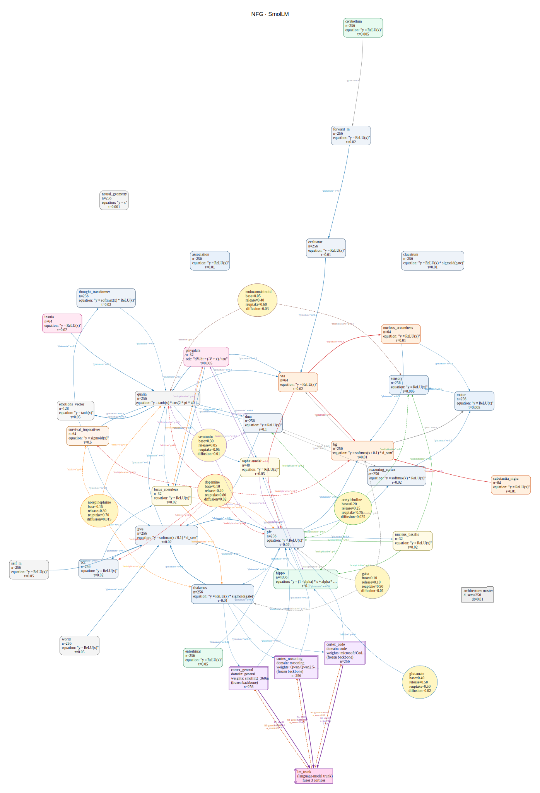

# BRIAN — Biologically Realistic Information Architecture Network

> *${TRUNK_TRAINABLE_PARAMS} trainable-param bowtie trunk · ${TOTAL_FROZEN_PARAMS} frozen cortex experts · exploring integrated information (Φ).*

[](#tests)
[]()
[]()
[]()
[]()
[]()

BRIAN is a research prototype that bets on **topology, Φ-coupled plasticity, and closed-loop embodiment** instead of raw parameter count. The core question: does a strategically-wired ${TRUNK_TRAINABLE_PARAMS}-param trunk outgeneralize a flat 100M transformer on OOD tasks?

**Current verdict:** 🟡 inconclusive — best variant ${LAYER_B_BEST_ROW} achieves **${LAYER_B_BEST_GAP_RATIO} gap\_ratio** (${LAYER_B_IMPROVEMENT_PCT}% better than flat-transformer baseline at ${LAYER_B_BASELINE_GAP_RATIO}), but matched-compute comparison is still pending.

---

## What it does

BRIAN combines five mechanisms into a single differentiable training loop:

| Pillar | What it is | Verified |
|--------|-----------|---------|
| **${BOWTIE_STAGES}-stage bowtie + re-entry loops** | Two re-entry paths enforce non-zero integrated information Φ | ✅ H1 |
| **Differentiable Φ objective** | Gaussian-MI MIP pushes gradients toward integrated states | ✅ H2–H3 |
| **Sheaf H¹ contradiction detection** | Narrative memory detects and resolves conflicting beliefs | ✅ H4–H5 |
| **Embodied survival loop** | GridWorld 10×10 with homeostatic drive shapes qualia and policy | ✅ H6.5 |
| **Multi-cortex fusion** | 3 frozen LM experts distil into the bowtie trunk via KL + NT-gated α | ✅ H16–H21 |

Full architecture spec and tensor shapes: [`docs/architecture.md`](docs/architecture.md).

---

## Implemented Mechanics

BRIAN currently composes **${CORE_MECHANISMS_COUNT}** named mechanisms drawn from neuroscience, dynamical systems, and information geometry. Every entry below is:

- a **first-class DSL primitive** — wires into any `.neuro` arch through a single block (`nfo: { … }`, `grid_positions: { … }`, …);
- **ReZero-disciplined** — a zero-init read-out / `alpha_init=0` makes the first forward bit-identical to a vanilla transformer, so additions never regress the baseline at step 0;
- **hypothesis-backed** — every mechanism cites an entry in [`hypothesis/`](hypothesis/) with a formal claim, code refs, test refs, and (where available) a Lean theorem.

### 🌀 Topology & Geometric Substrate

#### Neural Field Oscillator — H15 · H16 · H17 · H18

$$
\dot\varphi_i = \omega_i + \sum_j \kappa_{ij}\, A_j\,\sin(\varphi_j - \varphi_i), \qquad
\dot A_i = \mu\, A_i - \tfrac14\,(A_i^2 - A_\star^2)\, A_i
$$
$$
\Phi_\kappa(t) = \sum_{(i,j)\,\in\, E_{\mathrm{cut}}} \kappa_{ij}\, A_i(t)\, A_j(t), \qquad
y = h + \alpha\,\mathrm{ReadOut}\!\bigl(g\odot A\odot \cos(\varphi-\psi)\bigr)
$$

A Kuramoto graph (binding-by-synchrony) coupled to a Swift–Hohenberg cubic-quintic amplitude flow with Lyapunov $V(A)=\tfrac18(A^2-A_+^2)^2$. The topological coherence functional $\Phi_\kappa$ is a closed-form **lower bound on integrated information** (H15) and a unit-interval information-preserving gate (H16). Read-out is ReZero so the block earns capacity only under LM gradient pressure (H18).
*Source:* [`neuroslm/modules/neural_field_oscillator.py`](neuroslm/modules/neural_field_oscillator.py) · [`lib/blocks/neural_field_oscillator.neuro`](lib/blocks/neural_field_oscillator.neuro) · [`docs/NEURAL_FIELD_OSCILLATOR.md`](docs/NEURAL_FIELD_OSCILLATOR.md)

#### Hyperbolic (Poincaré-Disc) Attention

$$
g^c_x = \lambda_c(x)^2\, g^E,\quad
\lambda_c(x) = \frac{2}{1 - c\,\|x\|^2}, \qquad
d_c(x,y) = \tfrac{2}{\sqrt{c}}\,\operatorname{artanh}\!\bigl(\sqrt{c}\,\|{-x \oplus_c y}\|\bigr)
$$
$$
\text{logit}_{ij} = -\frac{d_c(Q_i, K_j)}{\sqrt{d_{\mathrm{head}}}}
$$

Query/key vectors are mapped into the Poincaré ball $\mathbb{D}^n_c$ via the exponential map at the origin; attention logits are **negative geodesic distances** instead of inner products. The exponential volume growth of the ball is the canonical embedding for tree-structured data (ASTs, dependency parses, scope chains).
*Source:* [`neuroslm/modules/hyperbolic_attention.py`](neuroslm/modules/hyperbolic_attention.py) · [`docs/features/hyperbolic_attention.md`](docs/features/hyperbolic_attention.md)

#### Multi-Scale Grid-Cell Positions — HPB Phase 2

$$
\mathbf{g}_k(t) = \bigl[\cos(2\pi t / T_k),\; \sin(2\pi t / T_k)\bigr], \qquad
T_k = T_0\cdot \varphi^{\,k},\quad \varphi = 1.618\ldots,\quad k = 0,\dots,K-1
$$

$K$ position scales at the golden ratio — the Sargolini/Stensola entorhinal-cortex grid module spacing. The $2K$ raw features project to `d_model` via a **zero-init head**, so the first forward is bit-identical to RoPE-only baseline; the dormant code path activates as the projection lifts off zero. Provable length-OOD extrapolation.
*Source:* `neuroslm/modules/grid_positions.py` · DSL: `grid_positions: { n_scales, scale_ratio, base_period }`

#### RoPE on the Tonnetz Torus

$$
\mathbf{p}_t = R\!\left(\tfrac{2\pi t}{P}\right)\!\mathbf{p}_{t-1}, \qquad
\mathbf{q}_t,\, \mathbf{k}_t \;\leftarrow\; \mathbf{q}_t\odot e^{i\theta_t},\; \mathbf{k}_t\odot e^{i\theta_t}
$$

Period-$P$ rotational embedding over the music-theoretic Tonnetz lattice — gives a *closed* cyclic prior under `tonnetz_period` chord-progression structure. Stacked with standard RoPE.
*Source:* `neuroslm/modules/positional.py` · DSL: `rope_base`, `tonnetz_period`

### 🧠 Memory & Predictive Coding

#### Episodic kNN Memory — HPB Phase 5

$$
\hat v_t = \sum_{j\,\in\, \mathrm{kNN}(q_t, M)} \mathrm{softmax}\!\bigl(\langle q_t, k_j\rangle/\tau\bigr)\, v_j, \qquad
y_t = h_t + \alpha\cdot \hat v_t
$$

A 4096-slot key/value store written either uniformly or **surprise-gated** (top-quantile of $\mathrm{nll}_{\mathrm{local}} - \mathrm{nll}_{\mathrm{global}}$). Read at every layer via kNN; $\alpha_{\mathrm{init}} = 0$ (ReZero). Memorizing-Transformers / RETRO style.
*Source:* `neuroslm/modules/episodic_memory.py` · DSL: `episodic_memory: { slots, k, alpha_init, write_gate }`

#### Multi-Scale Predictive Coding Cascade (MSPCC) — HPB Phase 3

$$
\mathcal{L}_{\mathrm{MSPCC}} = \sum_{\ell=1}^{L-1} \lambda_\ell\cdot \mathrm{KL}\!\bigl(q_\phi(z_{\ell+1}\mid h_\ell)\,\|\, p_\theta(z_{\ell+1})\bigr), \qquad
\lambda_\ell = w_0\cdot \gamma^{(L-1)-\ell}
$$

Applies an MDRV–VBB free-energy at **every adjacent layer pair**; the deepest (bowtie waist) pair dominates via geometric weight decay $\gamma$. Composes additively with the single-waist VBB.
*Source:* `neuroslm/modules/predictive_coding_residual.py` · [`docs/features/predictive_coding_residual.md`](docs/features/predictive_coding_residual.md) · DSL: `mspcc: { base_weight, layer_weight_decay }`

#### Local-Context Surprise Head — HPB Phase 5 (Mismatch Negativity)

$$
s_t = \mathrm{nll}_{\mathrm{local}}(x_t \mid x_{t-W:t}) - \mathrm{nll}_{\mathrm{global}}(x_t \mid x_{<t})
$$

A second tied LM head over a $W$-token local window; the per-token surplus surprise $s_t$ is exposed on every train forward and feeds the episodic write-gate. Sliding-window MMN analogue from EEG literature.
*Source:* `neuroslm/modules/surprise_head.py` · DSL: `surprise_head: { dim, local_window }`

#### Predictive-Coding Residual

$$
\hat h_{\ell+1} = f_\ell(h_\ell),\qquad
\varepsilon_\ell = h_{\ell+1} - \hat h_{\ell+1},\qquad
\mathcal{L}_{\mathrm{PC}} = \sum_\ell \|\varepsilon_\ell\|^2
$$

Each layer predicts the next layer's activations from its own; only the *prediction error* propagates as a residual. Implements Rao–Ballard hierarchical predictive coding.
*Source:* [`neuroslm/modules/predictive_coding_residual.py`](neuroslm/modules/predictive_coding_residual.py) · [`docs/features/predictive_coding_residual.md`](docs/features/predictive_coding_residual.md)

### 🔁 Distillation & Multi-Cortex Fusion

#### `cortex_pre_head_norm` — H16

$$
z_{\mathrm{trunk}} = W_{\mathrm{tied}}\cdot \mathrm{LayerNorm}(h_{\mathrm{trunk}})
$$

A LayerNorm **before** the tied LM head suppresses GPT-2's rogue dimension (std $\approx 24$, $82\times$ the median). Without it the init CE is ${H16_CE_WITHOUT} nats — *above* the uniform-distribution ceiling of ${H16_CE_UNIFORM}; with it: **${H16_CE_WITH} nats**.
*Source:* `neuroslm/cortex/multi_cortex_lm_head.py`

#### Per-Position Abstain Logit — H21

$$
\tilde z_{t,v} = \begin{cases}
z_{t,v} & v \in \mathrm{vocab}_{\mathrm{cortex}} \\[2pt]
\max_{v'\in\mathrm{vocab}_{\mathrm{cortex}}} z_{t,v'} - \ln V_{\mathrm{trunk}} & \text{otherwise}
\end{cases}
$$

Unmapped vocab slots get an abstain logit instead of a flat $-10^4$. Dropped standalone-cortex CE from **${H21_ABSTAIN_CE_BEFORE} → ${H21_ABSTAIN_CE_AFTER} nats**, unblocking the entire fusion pathway.
*Source:* `neuroslm/cortex/cortex_lm_head.py`

#### NT-Gated $\alpha$ Fusion

$$
\alpha_{\mathrm{eff}} = \sigma\!\bigl(W_{\mathrm{NT}}\cdot \mathrm{EMA}(\ell_{\mathrm{cortex}} - \ell_{\mathrm{trunk}})\bigr), \qquad
z = z_{\mathrm{trunk}} + \alpha_{\mathrm{eff}}\cdot (z_{\mathrm{cortex}} - z_{\mathrm{trunk}})
$$

An EMA-smoothed *neurotransmitter* signal collapses $\alpha_{\mathrm{eff}} \to 0$ once the trunk surpasses the cortex, and resumes contribution if the trunk regresses. Auto-retiring teacher.
*Source:* `neuroslm/cortex/nt_alpha_gate.py`

#### KL Distillation (Temperature-Scaled)

$$
\mathcal{L}_{\mathrm{KL}} = T^2 \cdot \mathrm{KL}\!\bigl(\mathrm{softmax}(z_{\mathrm{cortex}}/T).\mathrm{detach}\;\big\|\;\mathrm{softmax}(z_{\mathrm{trunk}}/T)\bigr), \quad
\lambda_t = \lambda_{\max}\cdot \mathrm{clip}\!\bigl((\ell_{\mathrm{cortex}} - \ell_{\mathrm{trunk}}) / \tau,\, 0, 1\bigr)
$$

Gap-ramped: $\lambda_t$ saturates at $\lambda_{\max} = 1.0$ when the trunk lags and shuts off when it leads. Pairs with the NT gate above.
*Source:* `neuroslm/cortex/distillation.py`

### 📐 Generalisation & Training Geometry (GIF stack)

#### GIF-1/2/3 — Adaptive Gap-Ratio Ramp — H7

$$
r_t = \frac{\mathrm{ppl}_{\mathrm{OOD}}(t)}{\mathrm{ppl}_{\mathrm{train}}(t)},\qquad
\beta_t = \beta_{\min} + (\beta_{\max} - \beta_{\min})\cdot \sigma(\kappa\,(r_t - r_\star))
$$

The VBB $\beta$, isotropy strength, and OOD-probe weight all ramp from a single gap-ratio signal $r_t$ → closed loop on generalisation gap rather than wall-clock schedule.
*Source:* `neuroslm/gif/adaptive_ramp.py` · DSL: `vbb_kl_floor_gamma`, `loss_var_window`

#### GIF-4 — Gap-Driven Label Smoothing — H8

$$
\varepsilon_t = \varepsilon_0 + (\varepsilon_{\max} - \varepsilon_0) \cdot \mathrm{clip}\!\bigl((r_t - 1) / (r^\star - 1),\, 0, 1\bigr)
$$

Label smoothing magnitude is itself gap-driven — increases as OOD/train diverges, shrinks as they re-align.
*Source:* `neuroslm/gif/label_smoothing.py` · DSL: `label_smoothing`

#### GIF-5 — Attention-Head Diversity — H9

$$
\mathcal{L}_{\mathrm{div}} = \frac{1}{H(H-1)}\sum_{i\ne j} \bigl\|\,P_i^\top P_j - \tfrac{1}{T}\mathbf{1}\mathbf{1}^\top\bigr\|_F^2
$$

Penalises pairwise alignment of attention probabilities $P_i$ across heads → forces encoder-side diversity, measurably cuts redundancy.
*Source:* `neuroslm/gif/head_diversity.py`

#### GIF-6 — Cosine LM Head — H10

$$
z_{t,v} = \tau\cdot \frac{\langle h_t,\, W_v\rangle}{\|h_t\|\cdot \|W_v\|}
$$

Cosine similarity (with learnable temperature $\tau$) instead of raw dot-product → eliminates the norm-mediated confidence asymmetry that biases LM heads toward high-norm trunk states.
*Source:* `neuroslm/modules/cosine_head.py` · DSL: `cosine_head: true`

#### GIF-7 — Homeostatic Gradient Equilibrium

$$
g_\ell \mathrel{:=} g_\ell \big/ \bigl(c + \mathrm{var}_{\mathrm{batch}}(\mathcal{L})\bigr), \qquad
\mathrm{var}_{\mathrm{batch}}(\mathcal{L}) \ge \mathrm{var}_{\min}
$$

Divisive normalisation of layer-wise gradients by the rolling batch-loss variance — keeps SNR constant across the trunk and prevents bowtie-waist collapse.
*Source:* `neuroslm/gif/gradient_equilibrium.py` · DSL: `divisive_grad_c`, `loss_var_min_mult`

#### Hyperbolic Bowtie Waist (HPB Phase 4)

$$
\mathrm{KL}_{\mathbb{D}^n_c}(q\|p) = \mathrm{KL}_{\mathbb{R}^n}(q\|p) + \log\det J_{\exp_0^c}(\mu_q)
$$

Wraps the VBB posterior on the Poincaré ball of curvature $c$. The Jacobian log-det correction **strictly upper-bounds** the Euclidean KL for any $\|\mu_q\| > 0$ — $\sigma$-collapse becomes geometrically harder.
*Source:* `neuroslm/gif/hyperbolic_bowtie.py` · DSL: `vbb_curvature`

#### ImprovementGate (Welch's $t$) — H5

$$
t = \frac{\bar x_A - \bar x_B}{\sqrt{s_A^2/n_A + s_B^2/n_B}},\quad
\mathrm{df} = \frac{(s_A^2/n_A + s_B^2/n_B)^2}{(s_A^2/n_A)^2/(n_A-1) + (s_B^2/n_B)^2/(n_B-1)}
$$

Every architecture mutation and DNA patch is gated by a two-sided Welch's $t$-test ($p < \alpha$) computed on the OOD-PPL pre/post window — no structural change lands without significance. Numerically pinned to scipy within $1\!\times\!10^{-6}$.
*Source:* [`neuroslm/verification/improvement_gate.py`](neuroslm/verification/improvement_gate.py) · `tests/verification/test_improvement_gate.py`

### ✨ Φ / Integrated Information

#### Φ-MIP Gaussian Objective — H1 · H2

$$
\Phi^{\mathrm{MIP}}(X) = \min_{(A,B)\,\in\,\mathrm{cuts}(X)} I(A;B), \qquad
\mathcal{L}_\Phi = -\tanh(\Phi^{\mathrm{MIP}} / 3)\cdot 3
$$

Differentiable lower bound on integrated information via the Gaussian-MI estimator over the **minimum information partition**; the bounded $-\tanh$ scalarisation gives a non-vanishing gradient that pushes the trunk toward integrated states.
*Source:* `neuroslm/iit/phi_mip.py`

#### Sheaf $H^1$ Contradiction Detection — H4

$$
H^1(\mathcal{F}) = \ker\delta^1 / \mathrm{im}\,\delta^0, \qquad
\text{contradiction} \;\iff\; H^1 \ne 0
$$

Narrative memory is encoded as a cellular sheaf $\mathcal{F}$ over the proposition graph; **non-zero first cohomology** means two stalks contradict ("likes coffee" vs "hates coffee") and triggers a `SUPERSEDES` edge. Belief revision = killing $H^1$.
*Source:* `neuroslm/sheaf/contradiction.py` · `tests/test_narrative_memory.py`

#### Personality Vector

$$
\pi = \mathrm{EMA}\!\bigl(\mathrm{Embed}(\text{identity-tokens})\bigr) \in \mathbb{R}^{${PERSONALITY_DIM}}
$$

A frozen embedding learned during embodied training that **survives weight reload** — verified across checkpoints (H6). Used as a stable identity vector for self-reference rate and cognitive-closure metrics.
*Source:* [`collectors/personality.py`](collectors/personality.py)

---




*The NFG is generated from `arch.neuro` → Hypergraph IR → PyTorch. Re-render with:*

```powershell
brian compile nfg --current          # → .neuro/nfg.png
brian compile nfg --current --heat heatmap.json   # → .neuro/nfg.heat.png
```

---

## The `.neuro` DSL

Architecture is specified declaratively in `.neuro` files — math-first ODEs and modulation rules that compile to byte-equivalent PyTorch:

```neuro
export population amygdala {
    count: 32,
    ode: "dV/dt = (-V + x) / tau",
    timescale: 0.005
}

modulation dopamine -> pfc {
    effect: "multiplicative", gain: 0.6,
    equation: "y = output * (c * gain)"
}
```

The compiler (`neuroslm/compiler/module_bundler.py`, `ribosome.py`) produces modules with **source maps** and **byte-identity round-trip** verification. ${DSL_TESTS} tests in `tests/dsl/` guard codegen correctness.

Full reference: [`docs/dsl.md`](docs/dsl.md).

---

## Multi-Cortex Fusion

Three frozen causal-LM experts sit above the bowtie trunk and fuse logits at the LM head:

| Domain | Expert | Params | Tokenizer bridge |
|--------|--------|--------|-----------------|
| General | `${EXPERT_GENERAL_MODEL}` | ${EXPERT_GENERAL_PARAMS} | cross-vocab retokenise |
| Code | `${EXPERT_CODE_MODEL}` | ${EXPERT_CODE_PARAMS} | direct (shared BPE) |
| Reasoning | `${EXPERT_REASONING_MODEL}` | ${EXPERT_REASONING_PARAMS} | cross-vocab retokenise |

|--------|--------|--------|-----------------|
| General | `${EXPERT_GENERAL_MODEL}` | ${EXPERT_GENERAL_PARAMS} | cross-vocab retokenise |
| Code | `${EXPERT_CODE_MODEL}` | ${EXPERT_CODE_PARAMS} | direct (shared BPE) |
| Reasoning | `${EXPERT_REASONING_MODEL}` | ${EXPERT_REASONING_PARAMS} | cross-vocab retokenise |

Three interlocking mechanisms govern the fusion:

1. **`cortex_pre_head_norm`** — LayerNorm before the tied head suppresses GPT-2's rogue dimension (std ≈ 24, 82× median). Without it, CE at step 0 = ${H16_CE_WITHOUT} nats (above the uniform-distribution ceiling of ${H16_CE_UNIFORM}). With it: **${H16_CE_WITH} nats**.

2. **Per-position abstain logit (H21)** — Unmapped vocab slots are filled with `max(mapped_logits) − ln(V_trunk)` instead of a flat `−1e4`. This single fix dropped standalone-cortex CE from **${H21_CE_BEFORE} → ${H21_CE_AFTER} nats** and unlocked the entire multi-cortex pathway:

   | Metric | broken (${H21_DEPLOY_BROKEN}) | fixed (${H21_DEPLOY_FIXED}) | Δ |
   |--------|--------|-------|---|
   | train PPL @ ${B4_STEPS} steps | ${H21_TRAIN_PPL_BROKEN} | **${B4_TRAIN_PPL}** | ${H21_TRAIN_PPL_DELTA} |
   | OOD PPL (WikiText-103-v1) | ${H21_OOD_PPL_BROKEN} | **${B4_OOD_PPL}** | ${H21_OOD_PPL_DELTA} |
   | `α_eff` | 0.000 (collapsed) | **0.500** (stable) | fusion alive |
   | `cortex_loss_ema` | ~${H21_CX_EMA_BROKEN} | **~${H21_CX_EMA_FIXED}** | ${H21_CX_EMA_DELTA} |

3. **NT-mediated α gating** — Once the trunk surpasses the cortex, an EMA inhibitory signal drives `α_eff → 0` so cortex experts retire automatically. The reverse also holds: cortex contribution resumes if the trunk regresses.

KL distillation runs in parallel: `L_KL = T² · KL(cortex.detach()/T ‖ trunk/T)` with a gap-ramped λ that saturates at 1.0 when the trunk lags and shuts off when it leads.

---

## Evidence

### Layer A — Mechanism Verification ✅

${LAYER_A_TEST_COUNT} unit tests across `tests/` confirm every mechanism computes as specified:

| Hypothesis | Result |
|-----------|--------|
| H1 — Φ > 0 for coupled outputs | ✅ Gaussian-MI MIP verified |
| H2 — Φ gradient is real | ✅ ‖∂L/∂θ‖ increases measurably |
| H3 — BDNF grows high-Φ paths preferentially | ✅ kernel rank expands on hot paths |
| H4 — Sheaf H¹ detects contradictions | ✅ "likes coffee" vs "hates coffee" → SUPERSEDES edge |
| H5 — Causal generalization from narratives | ✅ P(Joy\|Gift) > 0.8 from 10 examples |
| H6 — Personality survives weight reload | ✅ identity vector stable across checkpoints |
| H16 — `cortex_pre_head_norm` kills init loss | ✅ CE: ${H16_CE_WITHOUT} → ${H16_CE_WITH} nats |
| H19 — `ImprovementGate` (Welch's t) | ✅ p-values within 1e-6 of scipy; mutation blocked without significance |
| H21 — Per-position abstain unblocks fusion | ✅ ${H21_TRAIN_PPL_DELTA} train-PPL / ${H21_OOD_PPL_DELTA} OOD-PPL vs broken precursor |

Run all: `py -3 -m pytest tests/ -v` (~${TEST_RUNTIME_SECONDS}s on CPU).

### Layer B — OOD Generalization 🟡

Evaluated on WikiText-103-v1 held-out set. **gap\_ratio = OOD\_ppl / train\_ppl** (lower is better):

| Variant | Params | Steps | train\_ppl | OOD\_ppl | gap\_ratio | Log |
|---------|--------|-------|-----------|---------|-----------|-----|
| ${B0_VARIANT_NAME} | ${B0_TRAINABLE} | ${B0_STEPS} | ${B0_TRAIN_PPL} | ${B0_OOD_PPL} | **${B0_GAP_RATIO}** | - |
| BRIAN B1 (trunk + recursive) | ${B1_TRAINABLE} | ${B1_STEPS} | ${B1_TRAIN_PPL} | ${B1_OOD_PPL} | ${B1_GAP_RATIO} | - |
| BRIAN B2 (trunk + ReZero) | ${B2FIX_TRAINABLE} | ${B2FIX_STEPS} | ${B2FIX_TRAIN_PPL} | ${B2FIX_OOD_PPL} | ${B2FIX_GAP_RATIO} | - |
| BRIAN B3 (PCT trunk) | ${B3_TRAINABLE} | ${B3_STEPS} | ${B3_TRAIN_PPL} | ${B3_OOD_PPL} | ${B3_GAP_RATIO} | - |
| **${B4_VARIANT_NAME}** | **${B4_TRAINABLE}** | **${B4_STEPS}** | **${B4_TRAIN_PPL}** | **${B4_OOD_PPL}** | **${B4_GAP_RATIO}** | ${LOG_LINK:B4_LOG} |

${LAYER_B_BEST_ROW} is the first variant under ${B4_GAP_THRESHOLD} gap\_ratio — a ${LAYER_B_IMPROVEMENT_PCT}% improvement over the flat baseline — achieved at ${B4_COMPUTE_RATIO_VS_B0} fewer steps. Absolute OOD PPL (${B4_OOD_PPL}) still trails the baseline (${B0_OOD_PPL}), but the baseline ran ${B0_STEPS} steps. Matched-compute comparison is the immediate next experiment.

> ⚠️ gap\_ratio drifts upward within B4 (${B4_GAP_STEP500} → ${B4_GAP_RATIO} from step 500 → ${B4_STEPS}). The 10k follow-up run will distinguish plateau from accelerating overfit. See [`docs/findings.md#H21`](docs/findings.md#h21--per-position-abstain-logit-fixes-catastrophic-cortex-ce-2026-06-14).

### Latest Logs

**Best Run Overall (OOD / Combined Score):**
```
${LOG_TAIL:best:best:1}
```

**Most Recent Run (Last Checkpoint):**
```
${LOG_TAIL:latest:ood:3}
```

---

## Quick Start

```bash
python -m venv .venv
# Windows:
.\.venv\Scripts\Activate.ps1
# Linux/Mac:
source .venv/bin/activate

pip install -r requirements.txt
# Install torch separately to match your accelerator:
pip install torch --index-url https://download.pytorch.org/whl/cu121

# CPU sanity run (~${PRESET_TINY_PARAMS} params)
brian train --preset=tiny --steps=2000

# A100 full run (~${PRESET_XL_PARAMS} params, bf16)
brian train --preset=xl --steps=100000 --device=cuda

# Resume latest checkpoint
python -m neuroslm.train --resume latest

# Flat transformer ablation at matched params
python -m neuroslm.train --preset xl --baseline

# Interactive generation
python -m neuroslm.generate --prompt "Once upon a time"
```

Full Colab workflow (clone → ablation → training → benchmarks): [`colab_run.ipynb`](colab_run.ipynb).

---

## Parameter Presets

| Preset | Params | Accelerator | VRAM | Notes |
|--------|--------|-------------|------|-------|
| `tiny` | ~${PRESET_TINY_PARAMS} | CPU | — | sanity / CI |
| `small` | ~${PRESET_SMALL_PARAMS} | CPU | — | local dev |
| `medium` | ~${PRESET_MEDIUM_PARAMS} | T4 | 16 GB | |
| `large` | ~${PRESET_LARGE_PARAMS} | T4 | 15 GB | |
| `xl` | ~${PRESET_XL_PARAMS} | A100 | 40 GB | standard research run |
| `xxl` | ~${PRESET_XXL_PARAMS} | 4×A100 | 320 GB | |

Add `--baseline` for a parameter-matched flat transformer ablation.

---

## Configuration (`brian.toml`)

Single source of truth for the active architecture:

```toml
[current]
arch = "architectures/rcc_bowtie"   # active architecture
dna  = ""                            # .dna path for evolutionary training

[nfg]
output = ".neuro/nfg.png"
format = "png"                       # png | svg | pdf | dot
engine = "dot"
```

Override per-run with env vars: `BRIAN_ARCH`, `BRIAN_DNA`, `BRIAN_NFG_OUTPUT`. Contract locked by 27 tests in [`tests/test_project_config.py`](tests/test_project_config.py).

---

## Real-Time Architecture Evolution

BRIAN can mutate its own architecture during training. Mutations are gated by `ImprovementGate` (Welch's t-test) — no structural change lands without statistically significant fitness gain:

```python
from neuroslm.utils import EvolutionaryTrainingContext

with EvolutionaryTrainingContext("dna/base.dna", "checkpoints/") as ctx:
    harness = BRIANHarness(ctx.arch_path, resume_from=ctx.resume_step)
    for step in range(ctx.resume_step, 10000):
        loss = harness.train_step(batch)
        if step % 1000 == 0:
            harness.checkpoint_mutations()   # emits step_XXXXX.patch.dna
```

- RAID-5 protected DNA (triple redundancy)
- Incremental patches only — not full model state
- Hot paths (ρ > 0.7) grow via BDNF; cold paths (ρ < 0.1) prune
- Fault-tolerant: patch stack replayed from any checkpoint

---

## Loss Composition

| Term | Source | Weight |
|------|--------|--------|
| `lm_loss` | mesolimbic-gain-modulated cross-entropy | 1.0 |
| `phi_loss` | `−tanh(Φ/3)·3` from MIP estimator | 0.02 × maturation |
| `world_loss` | predicted vs target world embedding (MSE) | 0.3 × maturation |
| `pred_coding_loss` | per-layer next-layer prediction | 0.1 × maturation |
| `cortex_kl_loss` | `T²·KL(cortex.detach()/T ‖ trunk/T)` | λ\_t (gap-ramped, max 1.0) |
| motor, CPC, RSSM, novel aux | embodied + optional modules | 0.05–0.1 × maturation |
| `topo_loss` (H24) | `α·(Q_h − Q*)² + γ·ε_ortho` from `topo_charge` diagnostic | `α`, `γ` (default 0 = diagnostic-only) |
| `noether_loss` (H25) | `λ·(H_final − H_initial)²` leapfrog Noether residual | `λ` (default 0 = diagnostic-only) |

The maturation gate `_aux_w_scale ∈ [0.001, 1.0]` suppresses all aux losses until step ${MATURATION_STEP_THRESHOLD} (or lm\_loss < ${MATURATION_LM_LOSS_THRESHOLD}), so the LM gradient dominates during early training.

The `topo_loss` row (Phase 1 of the 3-mechanism THSD program) is enabled in arch.neuro by default as **diagnostic-only** (`α = γ = 0`): per-head Berg-Lüscher discrete windings `Q_h` and inter-layer orientation decorrelation `ε_ortho` are logged every step but zero is added to the loss. See `docs/findings.md` H24 + `neuroslm/mechanisms/topo_charge.py`. Activating the soft penalty (`α > 0` or `γ > 0`) is a follow-up experiment.

The `noether_loss` row (Phase 2 of the THSD program) is enabled in arch.neuro by default as **diagnostic-only** (`λ = 0`): `noether_H_diff = |H_final − H_initial|` is logged every step but zero is added to the loss. The Liouville symplectic residual block runs one leapfrog step on the final hidden state; det(J) = 1 is guaranteed by the triangular-shear structure of the Stoermer-Verlet integrator. See `docs/findings.md` H25 + `neuroslm/mechanisms/liouville_symplectic.py`.

---

## Introspection

```python
model.intelligence_metrics.snapshot()   # Φ, identity drift, causal density, self-reference rate
model.consciousness_metrics.per_tick()  # γ (binding), θ (memory), α (idling), coherence, ignition
model.narrative_stack.query_rules()     # discovered causal patterns with support counts
model.personality_vector               # tensor(${PERSONALITY_DIM}) — stable across checkpoints
```

---

## Tests

```bash
py -3 -m pytest tests/                                              # full suite (${LAYER_A_TEST_COUNT} tests, ~${TEST_RUNTIME_SECONDS}s)
py -3 -m pytest tests/test_phi.py -v                               # H1–H3: integrated information
py -3 -m pytest tests/test_narrative_memory.py -v                  # H4–H5: memory & causation
py -3 -m pytest tests/test_cognitive_closure.py -v                 # H6–H6.5: identity & embodiment
py -3 -m pytest tests/training/test_cortex_pre_head_norm.py -v     # H16: catastrophic-loss fix
py -3 -m pytest tests/training/test_cortex_distillation_and_gating.py -v  # H17–H18: KL + NT gating
py -3 -m pytest tests/verification/test_improvement_gate.py -v     # H19: Welch's t admission gate
py -3 -m pytest tests/dsl/ -v                                       # ${DSL_TESTS} DSL codegen + byte-equivalence
```

---

## Checkpoints

Pushed to `${HF_REPO_ID}` on HuggingFace Hub every ${HF_PUSH_EVERY} steps. Configure in `architectures/*/config.neuro`:

```neuro
checkpoint {
    push_backend: "hf"
    hf_repo_id: "${HF_REPO_ID}"
    hf_token_env: "HF_TOKEN"
    save_every: ${HF_SAVE_EVERY}
    push_every: ${HF_PUSH_EVERY}
    push_optimizer: false    # strips Adam state, ~2/3 size saving
}
```

**Skip LFS on laptops** (recommended):
```bash
git lfs install --local --skip-smudge   # fetch stubs only
git lfs pull --include="lfs_checkpoints/neuroslm_xl_adamw_mix_800.pt"  # pull one when needed
```

---

## Docs

| Document | Contents |
|----------|----------|
| [`docs/findings.md`](docs/findings.md) | Hypothesis ledger H1–H${LAST_HYPOTHESIS}: test files, result JSONs, raw logs. Source of truth for what's proven vs open. |
| [`docs/architecture.md`](docs/architecture.md) | Full spec: ${BOWTIE_STAGES}-stage forward pass, tensor shapes, equations, IIT 4.0 theory. |
| [`docs/formal_framework.md`](docs/formal_framework.md) | Normative math contract: sheaf ontology, H¹ guard, Φ guard, RAID-5 DNA, ImprovementGate spec, Lean roadmap. |
| [`docs/dsl.md`](docs/dsl.md) | `.neuro` syntax, macro system, compile pipeline, module bundling, source maps. |
| [`docs/technical_report.md`](docs/technical_report.md) | Executive summary: proven claims, open questions, all 7 pillars. |

---

*Open research. Issues, stars, and PRs welcome.*
